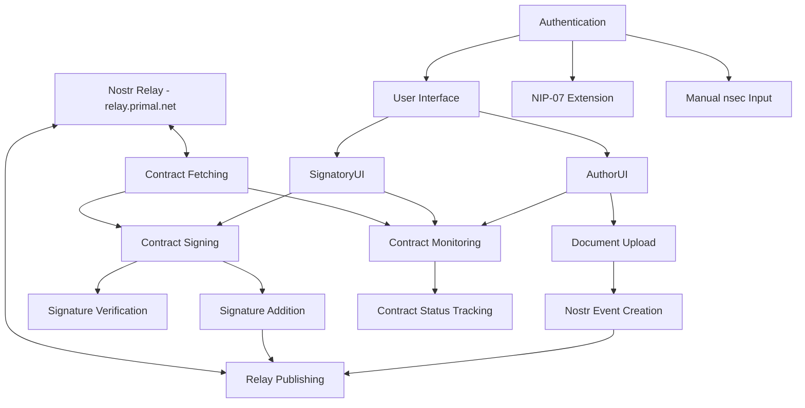

# Nostr Co-Signed Contracts Implementation Specification

## 1. Overview

### Purpose
This document outlines the implementation specification for a web-based prototype that enables multiple parties to co-sign contracts using the Nostr protocol, specifically leveraging `kind: 30023` events. The application allows users to upload markdown documents, specify required signatories, and collect signatures in a decentralized, verifiable manner.

### Core Functionality
- Document uploading and viewing (markdown format)
- Nostr integration for publishing and retrieving contract events
- Authentication via NIP-07 browser extensions or manual nsec input
- Signature creation and verification
- Contract status monitoring
- Handling of signature conflicts and revisions

### Key Challenges
- Nostr's immutable nature requires creating new events for each signature
- Managing the "current state" of contracts through event chains
- Detecting and resolving signature conflicts (forks)
- Ensuring cryptographic verification of all signatures

## 2. Architecture

### High-Level Architecture

```
+------------------+     +------------------+     +------------------+
|                  |     |                  |     |                  |
|  Authentication  |<--->|  Core Application|<--->|  Nostr Relay     |
|  Module          |     |  Logic           |     |  (relay.primal.net)|
|                  |     |                  |     |                  |
+------------------+     +------------------+     +------------------+
                               ^
                               |
                               v
                         +------------------+
                         |                  |
                         |  User Interface  |
                         |                  |
                         +------------------+
```

### Component Diagram



## 3. Data Models

### Contract Event Structure
```typescript
interface ContractEvent {
  contract_id: string;      // SHA-256 hash of content
  title: string;            // Title of the contract
  content: string;          // Markdown content of the contract
  version: number;          // Version number (typically 1)
  created_at: number;       // Unix timestamp of creation
  signers_required: number; // Minimum number of signatures required
  signatures: Signature[];  // Array of signatures
}

interface Signature {
  pubkey: string;           // Nostr public key (npub or hex)
  sig: string;              // Hex signature
  timestamp: number;        // Unix timestamp of signing
}
```

### Nostr Event Format
```typescript
interface NostrEvent {
  kind: number;             // 30023 for our contract events
  created_at: number;       // Unix timestamp
  tags: string[][];         // Array of tags
  content: string;          // JSON stringified ContractEvent
  pubkey: string;           // Publisher's public key
  id?: string;              // Event ID (computed)
  sig?: string;             // Event signature (computed)
}
```

### Tags Structure
```typescript
const tags = [
  ["contract", contractId],
  ["p", pubkey1],
  ["p", pubkey2],
  // Additional pubkeys as needed
  ["title", contractTitle]
];
```

### Local Storage Models
```typescript
interface UserPreferences {
  filterStatus: "needs_signature" | "signed" | "finalized" | "all";
  sortOrder: "newest" | "oldest";
}

interface AuthState {
  pubkey: string;
  method: "nip07" | "nsec";
  // nsec is never stored, only kept in memory during session
}
```

## 4. Core Components

### Authentication Module

#### Responsibilities
- Detect and connect to NIP-07 browser extensions
- Handle manual nsec key input
- Manage authentication state during session
- Provide signing capabilities to other components

#### Implementation Details
```typescript
class AuthManager {
  // Check if NIP-07 extension is available
  async checkForNip07(): Promise<boolean>;
  
  // Connect using NIP-07
  async connectWithNip07(): Promise<string>; // Returns pubkey
  
  // Connect using nsec (kept in memory only)
  connectWithNsec(nsec: string): string; // Returns pubkey
  
  // Sign data using authenticated key
  async sign(data: string): Promise<string>;
  
  // Get current pubkey
  getPubkey(): string;
  
  // Check if user is authenticated
  isAuthenticated(): boolean;
  
  // Logout
  logout(): void;
}
```

### Nostr Integration

#### Responsibilities
- Connect to relay.primal.net
- Publish contract events
- Subscribe to relevant events
- Handle event filtering and processing

#### Implementation Details
```typescript
class NostrClient {
  // Initialize connection to relay
  async connect(): Promise<void>;
  
  // Publish a contract event
  async publishContractEvent(event: NostrEvent): Promise<boolean>;
  
  // Fetch all events for a specific contract
  async fetchContractEvents(contractId: string): Promise<NostrEvent[]>;
  
  // Fetch contracts relevant to a user (as author or signatory)
  async fetchUserContracts(pubkey: string): Promise<NostrEvent[]>;
  
  // Subscribe to contract updates
  subscribeToContractUpdates(contractId: string, callback: (event: NostrEvent) => void): () => void;
  
  // Close connection
  disconnect(): void;
}
```

### Contract Management

#### Responsibilities
- Create new contracts from uploaded documents
- Generate contract IDs (SHA-256 hash)
- Track contract state through event chains
- Handle signature addition and verification

#### Implementation Details
```typescript
class ContractManager {
  // Create a new contract from markdown content
  async createContract(
    content: string,
    title: string,
    signatories: string[],
    signersRequired: number
  ): Promise<string>; // Returns contractId
  
  // Get current state of a contract
  async getContractState(contractId: string): Promise<ContractState>;
  
  // Sign a contract
  async signContract(contractId: string): Promise<SigningResult>;
  
  // Verify a contract's signatures
  async verifyContract(contract: ContractEvent): Promise<VerificationResult>;
  
  // Check if a contract has forks
  async detectForks(contractId: string): Promise<Fork[]>;
  
  // Resolve forks by creating a merged event
  async resolveForks(contractId: string, forks: Fork[]): Promise<string>; // Returns new event ID
}

interface ContractState {
  latestEvent: NostrEvent;
  allEvents: NostrEvent[];
  hasForks: boolean;
  forks?: Fork[];
  isComplete: boolean;
  needsUserSignature: boolean;
}

interface Fork {
  eventId: string;
  signatures: Signature[];
  timestamp: number;
}

interface SigningResult {
  success: boolean;
  hasForks?: boolean;
  forks?: Fork[];
  message?: string;
  newEvent?: NostrEvent;
}

interface VerificationResult {
  valid: boolean;
  reason?: string;
  validSignatures?: Signature[];
  isComplete?: boolean;
}
```

### UI Components

#### AuthorUI
- Contract list view with filtering and sorting
- Document upload interface
- Signatory management
- Contract status monitoring

#### SignatoryUI
- Contract list view with filtering and sorting
- Signing dialog with document preview
- Signature verification feedback
- Contract status monitoring

#### Shared Components
- MarkdownViewer: Renders contract content
- ContractList: Displays and filters contracts
- SigningDialog: Interface for reviewing and signing contracts
- AuthDialog: Authentication interface

## 5. Key Algorithms

### Contract Verification

```typescript
async function verifyContract(contract: ContractEvent): Promise<VerificationResult> {
  // 1. Verify content integrity
  const calculatedHash = await sha256(contract.content);
  if (calculatedHash !== contract.contract_id) {
    return { valid: false, reason: 'Content hash mismatch' };
  }
  
  // 2. Verify each signature
  const validSignatures = [];
  const seenPubkeys = new Set();
  
  for (const sig of contract.signatures) {
    // Check for duplicate signers
    if (seenPubkeys.has(sig.pubkey)) {
      continue; // Skip duplicate signatures
    }
    
    // Verify signature cryptographically
    const isValid = await verifySignature(
      sig.pubkey,
      contract.contract_id,
      sig.sig
    );
    
    if (isValid) {
      validSignatures.push(sig);
      seenPubkeys.add(sig.pubkey);
    }
  }
  
  // 3. Check if enough valid signatures
  const isComplete = validSignatures.length >= contract.signers_required;
  
  return {
    valid: true,
    validSignatures: validSignatures,
    isComplete: isComplete
  };
}
```

### Fork Detection and Resolution

```typescript
async function detectForks(contractId: string): Promise<Fork[]> {
  // 1. Fetch all events for this contract
  const events = await fetchContractEvents(contractId);
  
  // 2. Group events by their signatures
  const signatureSets = new Map<string, NostrEvent[]>();
  
  for (const event of events) {
    const content = JSON.parse(event.content);
    const signaturesKey = content.signatures
      .map(s => `${s.pubkey}:${s.timestamp}`)
      .sort()
      .join('|');
    
    if (!signatureSets.has(signaturesKey)) {
      signatureSets.set(signaturesKey, []);
    }
    
    signatureSets.get(signaturesKey).push(event);
  }
  
  // 3. Find the latest event for each signature set
  const latestEvents = Array.from(signatureSets.values())
    .map(events => events.sort((a, b) => b.created_at - a.created_at)[0]);
  
  // 4. If we have multiple latest events, we have forks
  if (latestEvents.length <= 1) {
    return [];
  }
  
  // 5. Create fork objects
  return latestEvents.map(event => {
    const content = JSON.parse(event.content);
    return {
      eventId: event.id,
      signatures: content.signatures,
      timestamp: event.created_at
    };
  });
}

async function resolveForks(contractId: string, forks: Fork[]): Promise<string> {
  // 1. Get the base contract content
  const events = await fetchContractEvents(contractId);
  const baseEvent = events.sort((a, b) => a.created_at - b.created_at)[0];
  const baseContent = JSON.parse(baseEvent.content);
  
  // 2. Collect all unique signatures from all forks
  const allSignatures = new Map<string, Signature>();
  
  for (const fork of forks) {
    for (const sig of fork.signatures) {
      if (!allSignatures.has(sig.pubkey) || 
          allSignatures.get(sig.pubkey).timestamp < sig.timestamp) {
        allSignatures.set(sig.pubkey, sig);
      }
    }
  }
  
  // 3. Create new content with merged signatures
  const newContent = {
    ...baseContent,
    signatures: Array.from(allSignatures.values())
  };
  
  // 4. Create and publish new event
  const newEvent = {
    kind: 30023,
    created_at: Math.floor(Date.now() / 1000),
    tags: [
      ["contract", contractId],
      // Include other tags from original event
      ...baseEvent.tags.filter(tag => tag[0] !== "contract")
    ],
    content: JSON.stringify(newContent),
    pubkey: await authManager.getPubkey()
  };
  
  const signedEvent = await finalizeEvent(newEvent);
  await relay.publish(signedEvent);
  
  return signedEvent.id;
}
```

### Signing Process

```typescript
async function signContract(contractId: string): Promise<SigningResult> {
  // 1. Get current state
  const state = await getContractState(contractId);
  
  // 2. Check for forks
  if (state.hasForks) {
    return {
      success: false,
      hasForks: true,
      forks: state.forks,
      message: "Contract has multiple versions. Please resolve before signing."
    };
  }
  
  // 3. Get latest event
  const latestEvent = state.latestEvent;
  
  // 4. Check if user already signed
  const userPubkey = authManager.getPubkey();
  const content = JSON.parse(latestEvent.content);
  const alreadySigned = content.signatures.some(sig => sig.pubkey === userPubkey);
  
  if (alreadySigned) {
    return {
      success: false,
      message: "You have already signed this contract."
    };
  }
  
  // 5. Create signature
  const signature = await authManager.sign(content.contract_id);
  
  // 6. Create new signature object
  const newSignature = {
    pubkey: userPubkey,
    sig: signature,
    timestamp: Math.floor(Date.now() / 1000)
  };
  
  // 7. Create new content with updated signatures
  const newContent = {
    ...content,
    signatures: [...content.signatures, newSignature]
  };
  
  // 8. Create completely new event
  const newEvent = {
    kind: 30023,
    created_at: Math.floor(Date.now() / 1000),
    tags: [
      ["contract", contractId],
      // Include other tags from original event
      ...latestEvent.tags.filter(tag => tag[0] !== "contract")
    ],
    content: JSON.stringify(newContent),
    pubkey: userPubkey
  };
  
  // 9. Sign and publish the new event
  const signedEvent = await finalizeEvent(newEvent);
  await relay.publish(signedEvent);
  
  return {
    success: true,
    newEvent: signedEvent
  };
}
```

## 6. User Flows

### Authentication Flow
1. User opens the application
2. User is presented with authentication options:
   - Connect with NIP-07 extension
   - Enter nsec key manually
3. User authenticates using preferred method
4. System stores authentication state for the session
5. User is redirected to the contract list view

### Contract List Flow
1. User is presented with the contract list after authentication
2. System fetches contracts where:
   - User is the author
   - User is a required signatory
3. User can filter contracts by status:
   - "Needs me to sign"
   - "I have signed"
   - "Finalized"
4. User can select a contract to view details or sign
5. User can initiate a new contract upload

### Contract Creation Flow
1. User clicks "Upload Contract" button
2. User uploads a markdown document
3. System displays document preview
4. User enters contract title
5. User adds signatory pubkeys
6. User specifies minimum required signatures
7. User confirms creation
8. System:
   - Generates contract_id (SHA-256 hash of content)
   - Creates initial Nostr event
   - Publishes to relay.primal.net
9. User is redirected to contract details view

### Signing Flow
1. User selects a contract requiring their signature
2. System displays contract details and content
3. User reviews the contract
4. User clicks "Sign" button
5. System:
   - Checks for conflicts/forks
   - If conflicts exist, presents resolution options
   - If no conflicts, creates signature
   - Creates new Nostr event with updated signatures
   - Publishes to relay.primal.net
6. User sees confirmation of successful signing
7. Contract status updates in the list view

### Fork Resolution Flow
1. User attempts to sign a contract with forks
2. System detects forks and presents them to the user
3. User reviews the different versions
4. User selects "Resolve Forks" option
5. System:
   - Creates a new event combining all signatures
   - Publishes to relay.primal.net
6. User can now proceed with signing the merged version

## 7. Implementation Plan

### Phase 1: Project Setup
- Create React/TypeScript application with Vite
- Install dependencies
- Set up project structure
- Configure basic routing

### Phase 2: Core Infrastructure
- Implement Authentication Module
- Set up Nostr relay connection
- Create basic data models
- Implement contract creation and fetching

### Phase 3: Contract Management
- Implement contract verification
- Create signature handling
- Develop fork detection and resolution
- Build contract state management

### Phase 4: User Interface
- Create authentication screens
- Build contract list view
- Implement document upload and preview
- Develop signing dialog
- Create contract details view

### Phase 5: Testing and Refinement
- Test with multiple users
- Verify signature verification
- Ensure proper conflict handling
- Refine user experience

## 8. Technical Considerations

### Security
- nsec keys should never be stored, only kept in memory during session
- All cryptographic operations should use established libraries
- Input validation for all user inputs
- Sanitization of markdown content

### Performance
- Efficient fetching and filtering of Nostr events
- Pagination for contract lists
- Optimistic UI updates

### Limitations
- Single relay (relay.primal.net) for simplicity
- Sequential signing approach (1a)
- No invitation mechanism in prototype
- Limited conflict resolution options

### Future Enhancements
- Multi-relay support
- Enhanced fork visualization
- Invitation system
- Support for parallel signing (1b approach)
- Integration with other Nostr clients
